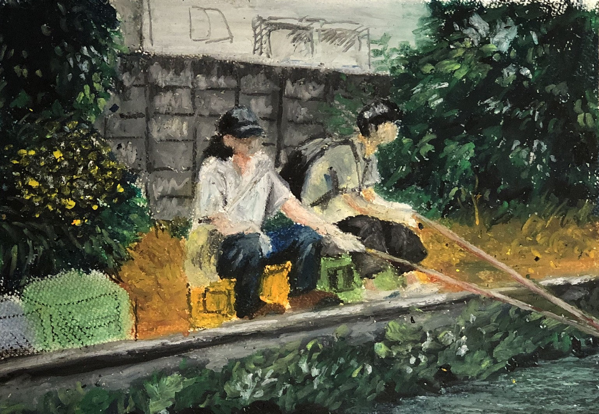
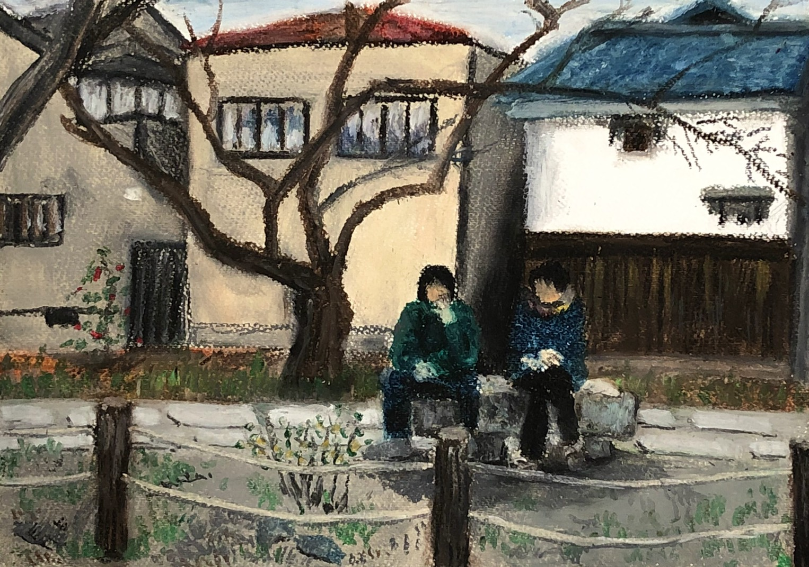

介護のアルバイトをしているので、COVID-19の対応として国から介護施設への慰労金をわたしはもらった。前の全世帯の給付金ももらった。まだ使いみちが決まらない。

大濱くん(osamuosanai)から『弱いZINE』に寄稿しませんかと連絡をもらい、書きます、と元気よく返事をしてから1ヶ月ちかく。
ようやくまとまりもなく、書く。

わたしは数年前に「賢いユリシーズ」でドラムを叩いていた。それ以降は東京都でアルバイトを転々としている。友だちがいないので、孤独だ。
家から出ることがあれば出ないこともあり、だらだらとしている。

1ヶ月ぐらい前から、カンナビジオール(CBD)という成分のオイルとリキッドを使いはじめた。
わたしの理解で打つと、CBDは麻に含まれる成分の1種でリラックスやよく眠れる効果があるみたい。オイルは舌下摂取で、リキッドは電子たばこのように吸引をする。
幻覚作用はないけれど、使いはじめたときから気分が良く、チルだと思っている。
世界のどこかで「大麻解禁」みたいなニュースをたまに目にするけど、この国ではCBDは良いみたいだ。変なの。

そういえば、CBDを知ったのは「ホームレス状態の人が路上で売る雑誌『ビッグイシュー　日本版』」の特集のひとつだったのを思い出す。
この雑誌の最近の特集が「アップデートしたい『LGBT』」でとても良かった。

読んだそばから忘れていくけれど、本を読む。
社会の問題を考えたり解決しようとする本を読みおえると、ただ読んだだけで終わる。その後にわたしのこととしてアクティブな物事につなげていない。
じゃあ、小説も読むと忘れていくけど、なにが残るのだろう。
読んで忘れてなにもしないで、なにをしているんだろう、とわたしは思う。

最近、動画配信サイトのNETFLIXで「クィア・アイ」というドキュメンタリーを観ている。内容はすてきな5人が毎回ひとりの人物の生活を良くするために家、ファッション、料理、髪型、文化をプロデュースする。
わたしは観ていて、とてもいろいろな参考になるけれど、おちおちしていると本を読むことと同じことだ。

あらためて文章を打つのは健康に良い。わたし個人の整理というか、見ようとしていなかった現在を入力すると、こんなところにいるんだ、こんな状態なんだと確かめれる。健康に良い。
もうなにもかもが遠いところにいる。そんなこんなで生きている。

さあ今日はヴィーガン料理を食べに行こう。
