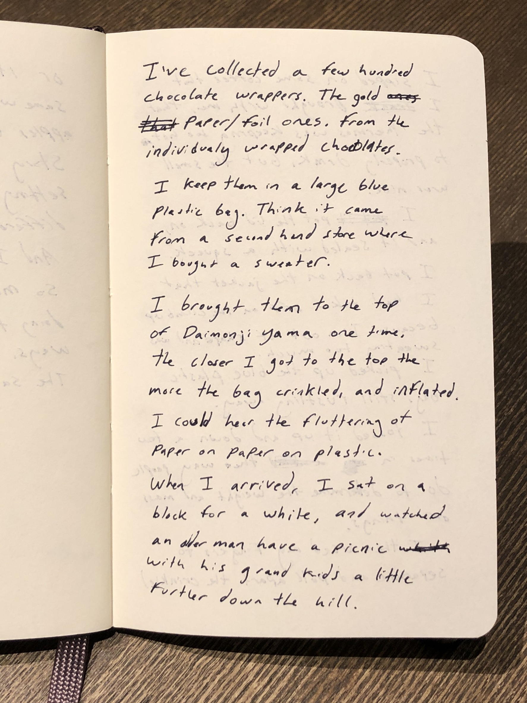
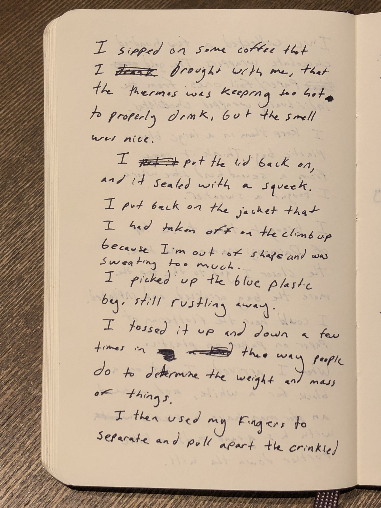
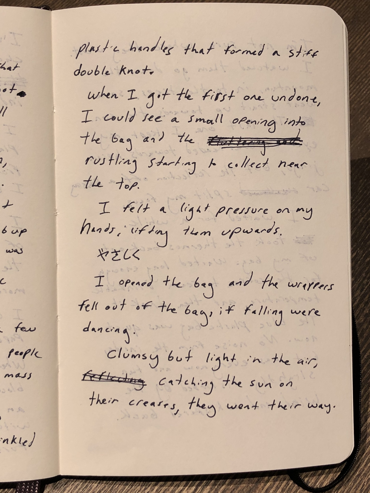
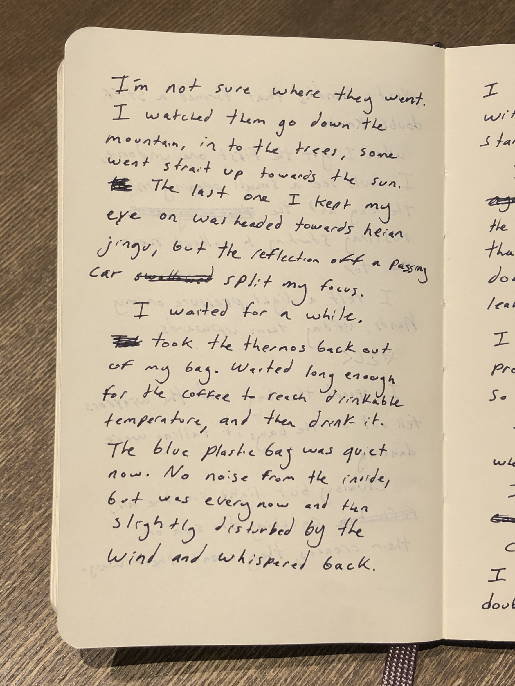
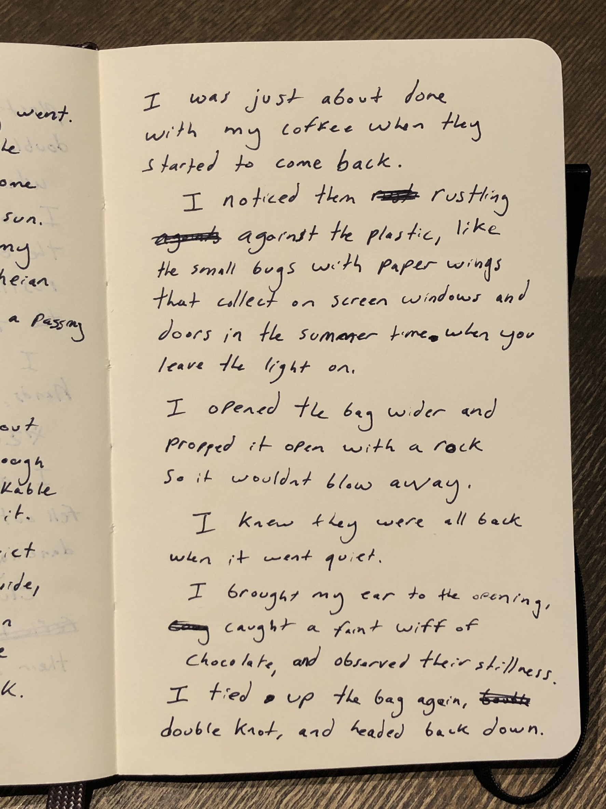

I’ve collected a few hundred chocolate wrappers. The gold paper / foil ones, from the individually wrapped chocolates.

I keep them in a large blue plastic bag. I think it came from a second hand store, where I bought a sweater.

I brought them to the top of Daimonji mountain one time. The closer I got to the top, the more the bag crinkled and inflated. I could hear the fluttering of paper on paper on plastic.

When I arrived, I sat on a block for a while, and I watched an older man have a picnic with his grand kids a little further down the hill.

I sipped on some coffee that I brought with me. The thermos kept it too hot to drink but the smell was nice.

I put the lid back on and it sealed with a squeak.
I put back on the jacket that I had taken off on the climb up.

I picked up the blue plastic back, still rustling away.
I tossed it up and down a few times, the way people do to determine the weight and mass of things.

I used my fingers to separate the plastic handles that formed a stiff double knot.
When I got the first one undone, I could see a small opening into the bag and the rustling started to collect near the top.
I felt a light pressure on my hands, lifting them upwards.
やさしく
I opened it further and the wrappers fell out of the bag, if falling were dancing.
Clumsy, but light in the air, catching the sun on their creases, they went their way.

I’m not sure where they went. I watched them do down the mountain, into the trees, towards the town, some went straight up towards the sun.
The last one I kept my eye on was headed towards Heian shrine, but I lost track of if it with the reflection of a passing car.

I waited for a while.
Weighted the plastic bag with a rock.
Took the thermos back out of my pocket.
Waited long enough for the coffee to reach drinkable temperature, then drank it.
The blue plastic bag was quiet now. No noise from the inside, but when the wind had something to say, it crinkled back.

I was just about done with my coffee when they started to come back.
I noticed them rustling against the plastic, like the small bugs with paper wings that collect on screen windows and doors in the summer time when you leave the light on.

I opened the bag and propped it open with the rock, so it wouldn’t blow away.
I knew they were all back when it went quiet.
I brought my ear to the opening, caught a whiff of chocolate, and observed their stillness.

I tied up the bag again, double knot, and headed back down.
