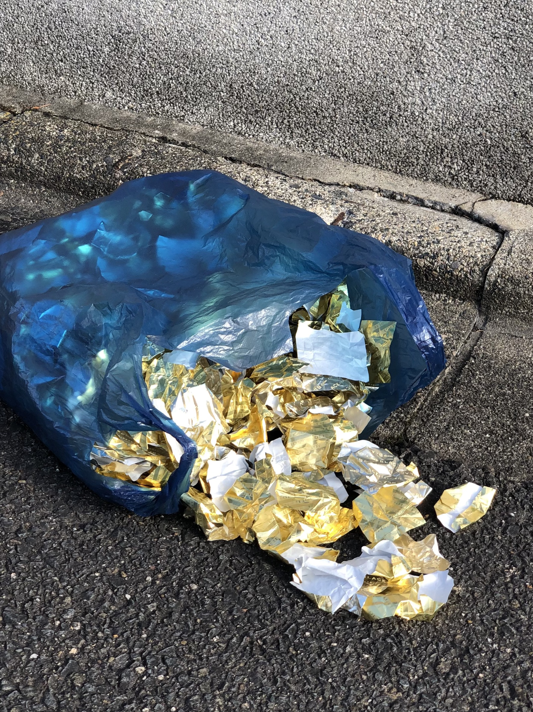
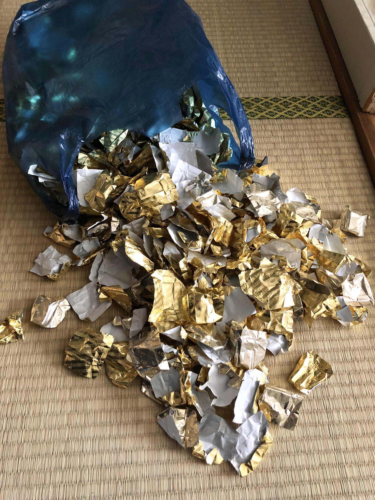

### ※ 下に日本語訳があります
I’ve collected a few hundred chocolate wrappers.
The gold paper / foil ones, from the individually wrapped chocolates.

I keep them in a large blue plastic bag.
I think it came from a second hand store, where I bought a sweater.

I brought them to the top of Daimonji mountain one time.
The closer I got to the top, the more the bag crinkled and inflated.
I could hear the fluttering of paper on paper on plastic.

When I arrived, I sat on a block for a while,
and I watched an older man have a picnic
with his grand kids a little further down the hill.

I sipped on some coffee that I brought with me.
The thermos kept it too hot to drink but the smell was nice.

I put the lid back on and it sealed with a squeak.
I put back on the jacket that I had taken off on the climb up.

I picked up the blue plastic back, still rustling away.
I tossed it up and down a few times,
the way people do to determine the weight and mass of things.

I used my fingers to separate the plastic handles
that formed a stiff double knot.
When I got the first one undone,
I could see a small opening into the bag and
the rustling started to collect near the top.
I felt a light pressure on my hands, lifting them upwards.

やさしく

I opened it further and the wrappers fell out of the bag,
if falling were dancing.
Clumsy, but light in the air,
catching the sun on their creases, they went their way.

I’m not sure where they went.
I watched them do down the mountain, into the trees,
towards the town, some went straight up towards the sun.
The last one I kept my eye on was headed towards Heian shrine,
but I lost track of if it with the reflection of a passing car.

I waited for a while.
Weighted the plastic bag with a rock.
Took the thermos back out of my pocket.
Waited long enough for the coffee
to reach drinkable temperature, then drank it.
The blue plastic bag was quiet now.
No noise from the inside,
but when the wind had something to say, it crinkled back.

I was just about done with my coffee
when they started to come back.
I noticed them rustling against the plastic,
like the small bugs with paper wings
that collect on screen windows and doors in the summer time
when you leave the light on.

I opened the bag and propped it open with the rock,
so it wouldn’t blow away.
I knew they were all back when it went quiet.
I brought my ear to the opening,
caught a whiff of chocolate, and observed their stillness.

I tied up the bag again, double knot, and headed back down.

### 日本語訳

私はチョコレートの包み紙を数百個集めていた。
それは金色のホイル紙で、個別に包まれたものだった。

それを青い大きなビニール袋に入れて保管していた。
リサイクルショップでセーターを買った時にもらった袋。

以前、大文字山の山頂までそれを持って行ったことがあった。
頂上に近づけば近づくほど、袋がしわくちゃになって膨らんでいった。
プラスチックと紙が当たってバタバタする音が聞こえていた。

到着してしばらくブロックの上に座っていると、
少し下ったところでおじいさんが孫とピクニックをしているのが見えた。

持ってきたコーヒーを一口啜った。
魔法瓶にいれてきたのでまだ飲むには熱すぎだったが、いい香りがした。

蓋をすると、キーッという音を立てて閉まった。
そして登るときに脱いでいた上着を着直した。

青いビニール袋を拾い上げると、まだガサガサ音がする。
物の重さや質量を判断するときのように、何度か上下に投げてみた。

私は指でビニール袋の二重の結び目を解いた。
最初のものをほどくと、袋の小さな開口部と、上部付近のガサガサした包装紙が見えた。
手を上に持ち上げるような軽い圧迫感を感じた。
やさしく、さらに開けてみると、袋の中から包装紙が舞うように落ちていった。
不器用だけど、軽やかに、空気に触れて、折り目に日光を受けて、彼らは自分の道を進んでいった。

彼らがどこへ行ったのかはわからない。
私は彼らが山を下っていくのを、木々の中に入っていくのを、
町に向かっていくのを見ていた。
ある者は太陽に向かってまっすぐ上っていった。
最後の一枚は平安神宮に向かっていったが、
通りすがりの車の反射で見失ってしまった。

しばらく待った。
ビニール袋が飛ばないように石を置いた。
ポケットから魔法瓶を取り出した。
コーヒーが飲める温度になるのを待ってから飲んだ。
青いビニール袋は静かになった。
中からは何の音もしなかったが、
風が何か言いたげにしていると、再びしわくちゃになってきた。

コーヒーを飲み終えようとしたところで、彼らが戻ってきた。
夏の間、電気をつけっぱなしにしていると
網戸や窓に薄い羽のついた小さな虫が集まってくるように、
ビニール袋に向かってガサガサと音を立てているのに気づいた。

私は袋を開けて、吹き飛ばされないように石で支えた。
静かになると、みんな戻ってきたのがわかった。
私は開口部に耳を近づけ、
チョコレートの匂いを嗅ぎ、彼らの静けさを観察した。

私は再び袋を二重結びにして、下に向かった。

