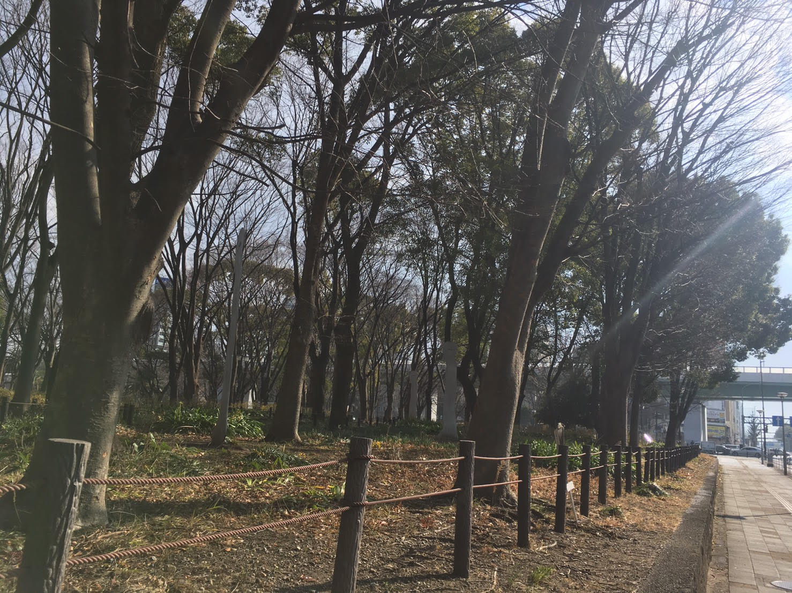

### 2021/1/20

早朝に起きて、急いで身支度をしていると、居間の時計がおかしい。

針がすごい勢いで回っている。ぐるぐると、止まる気配が無い。

分針が５秒で一周してしまう。

いまは、、２時？

なめらかな針が実家のまだ暗い朝を、音もなく、かき混ぜている。

焼いたパンをかじりながら、今起こっていることについて、一歩引いて考えた。音の無い朝。

そうしたら、自分の思考が、見えてきた。

**Ａ**
まず、怖いと感じた。不気味な朝。それでも、時計は神棚のようにいつも上のほうにあるから、部屋を守る神様のように見える。神様が荒ぶっているのか。

**Ｂ**
神様が怒っているのか、なにか張り切っているのか。

いつだって神の啓示には理由があって、それを考えた。どんな理由なのか。すぐにはわからないことのようだけど、とにかく、その瞬間から考えはじめた。

**C**
携帯電話を見た。時刻は5:50。いつも正しい、僕の時計です。液晶パネルの、みんなの時計。針の遅れを治したりする必要もない。豪奢な時計台を眺める代わりに、みんな手元の鏡を見るようになった。

みんなの時計がマトモだという確認のために、見たのだ。思った通りだな、という地味な印象の、「みんなの時計」

**D**
まだ寝ている父や母にどういう風に教えるか、考えた。

さすがにギョッとするだろうな、この時計の動きを見たら。

あんまり朝から驚いて欲しくないと思って、あとでグループラインするとこにした。「時計が変！」

**E**
時計は止まらない。まだつっ走っている。神様の言葉のヒントは、もしかしたら未来にあるの？早く行けと、言われてる。

これからしてみたいこと、行ってみたいところ、会いたい人のことを考えた。あって何をしよう？何を話そう？この時計の話はするだろうか。

「いつも神社で手を合わせる時に、身の回りの人のことを思い浮かべてみる。もはや癖というか、ゲームみたいになってて、顔をどんどん探していく。あの人からその人へ、飛んでいく。これが走馬灯みたいなんだよ」と隣にいる人に打ち明けた。先日。

「そうなんだね」「忙しそうだねえ」

いまは、

ぼくの馬がずっと前を走っている。

あの時計も追い越してしまいそう。

https://youtu.be/q96BOmfTOy8
