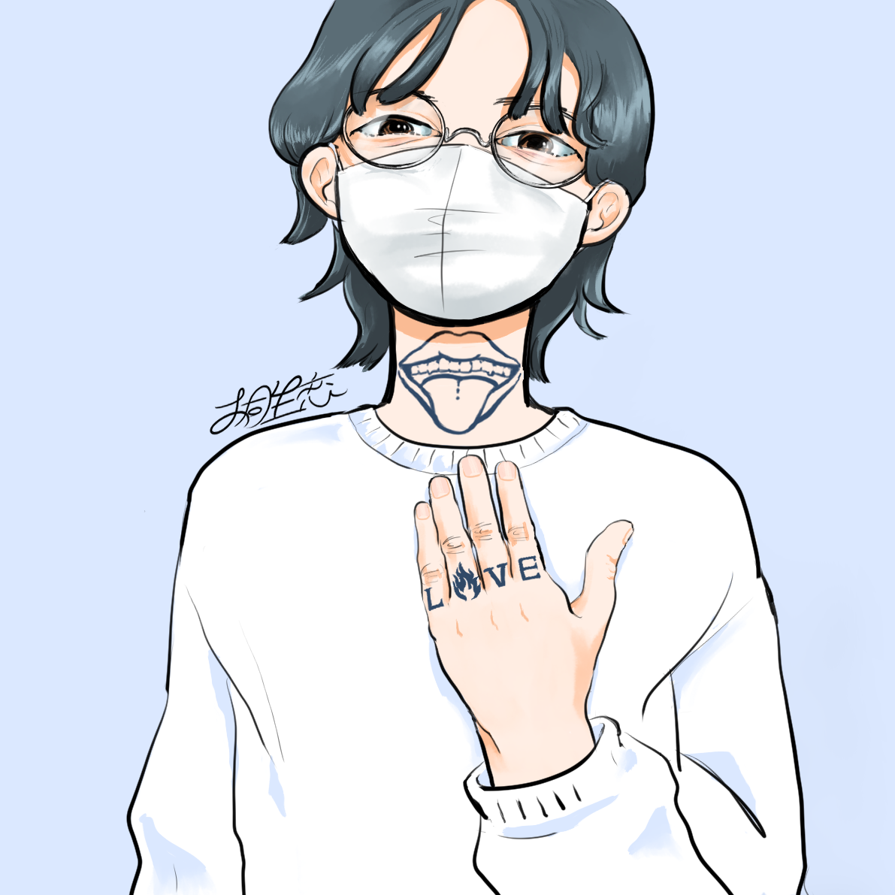

大きい声で 何も言わなくてもいい、
弱いままで何か言える方法が あれば良いなと思っていて。
もちろん美術作品を作ることは そういうことに つながるのだけど、
もう少し、今すぐ自分を 助けてあげられる、
自分のための 手法を持っていても 良いのかなと最近考え始めた。
自分の代わりに 誰かが言ってくれたら
いいのになとも 思っているけど、
強くいるための つらさみたいなのを
誰かに押し付けるのは とてもいやだなあと思ったので
かわりに何か言ってくれる人を 描こうと思った。
自分のための自分の味方。
創作物でしかないし 実在しないけど、
そういうものが 現実に与える影響を、
わたしはとても実感している。

