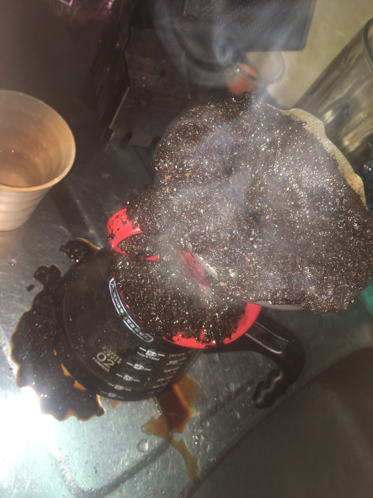
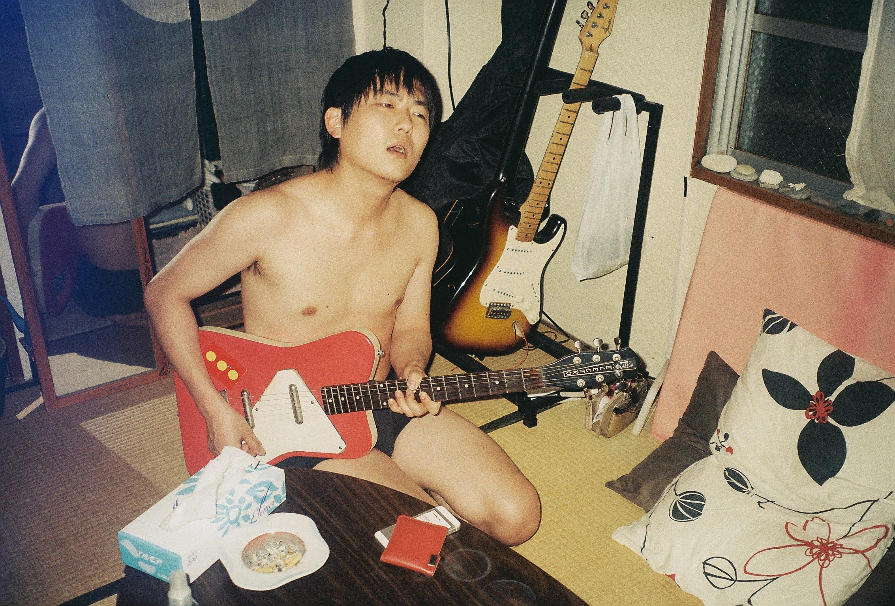

### （現実の）

もうどこにも行けない。 僕は弱い。
諦めて敗走している。 全てが敵のように感じる。 それでも敵対心など 持てる力さえ 残されてはいない。
逃げることに 憧れた時もあった。 死ぬ事を強烈に 恐れる日々もあった。 今は諦めて敗走している。
意味もなく逃げ回っている。 逃げても無駄なのに、 それしか出来ない。
次の苦い一滴が 胸に滴り落ちる瞬間に 僕はまた 命より大切にしていた心を 腐らせてしまう。
君にはわからないだろうの 蓄積が意味の無い 城壁を建築し、 意味の無い事に 意味の無さを見出し、 意味のなさに辟易した。
もう全てがどうでも良くない。 諦めが空回る。 存在する事に吐き気がする。
いつでも痙攣が 止まらなくなって 死ぬ気がする。
てんかんの発作が戻ってきた。
懐かしさ自身が 涙を流しながら 僕に迫ってくる。
どれだけ力を振り絞っても 全く意味がない パターンの絶望を 軽過ぎるナイフのように 振り回しながら、

彼は、

彼は、

闇の中で目を覚ました瞬間に 夢で何度殺されたか 数えている。
逃げる事さえ出来なかった 僕の生き方は、 触れようとする全ての物事を 下手に責め立てる無力さを 象徴していた。
読むだけで立ち上がれなくなる このテキストもまた 全く嫌なものであり、
使い方によっては 便利な道具になったりもせず、
意味もなく存在感だけを 誇張している。
だけどもし 僕が物語を書くならば、 誰も彼も一人も死なない。
犬も鳥も猫も虫も。 花は枯れず、姿見せずとも あの植物的な香りを漂わせる。
僕も君も少し臭くて汚いけれど 生きる事に向き合っただけの 眼差しをあの瞬間から 取り戻している。
そういった物語を 敗走中に叫び続けながら この人生を終えようと思う。
(小さい声と大きな声で 語りかけてくる者からの 手紙を歌に例えるとすれば) だってそれは
形を持たないで いようとするなら (抵抗する気も無いが)
急に踊るのをやめて、 ボトルに入った水を 一口飲み、振り返り、 部屋に飾ってある草の長さを 昨日と比べてみる。

### （降ってきた歌）

https://www.youtube.com/watch?v=OB0TQRL9phk

君の孤独の中で 僕は生きている。
夢の中で語りかけている。
僕は歌の中で息をしている。
誰にも見つからない 鼻歌のメロディ。
この町に来て、 いろいろあって、 魂が抜けて、 僕が僕を見て、 嘘をついた、 明日は来るよ、
でも、もう何も持てないよ、 こんな荷物じゃ。
戻れない道、 戻っていく歌。 帰れない町へ運んでく、 深い場所。
いっぱい転がる脚ない椅子、 タダ乗り各停、 暇切り裂いて、
至る所に転がる味ない水、 形になる前に 溶けていくmy ego
鏡も時計も いつかは消えるから、 その時を待ってる君を 愛してる寂しさ。
溶けゆく境が僕らのメロディを 繋ぎ留めている。
その時を待ってる君を 愛してる寂しさ。
ぼくはきみのさみしさ。
君の孤独の中で 僕は生きている。 夢の中で語りかけている。
僕は歌の中で息をしている。 誰にも見つからない 鼻歌のメロディ。
僕は君のさみしさ。

