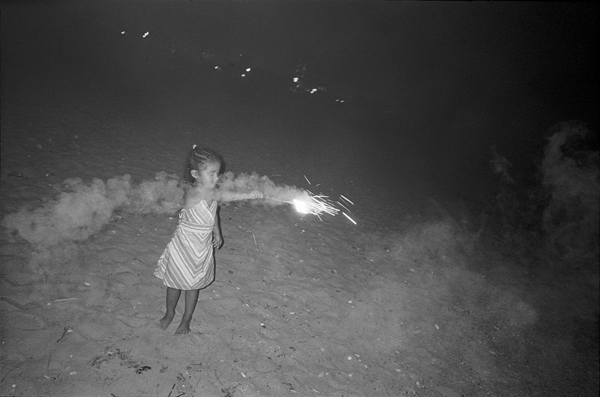
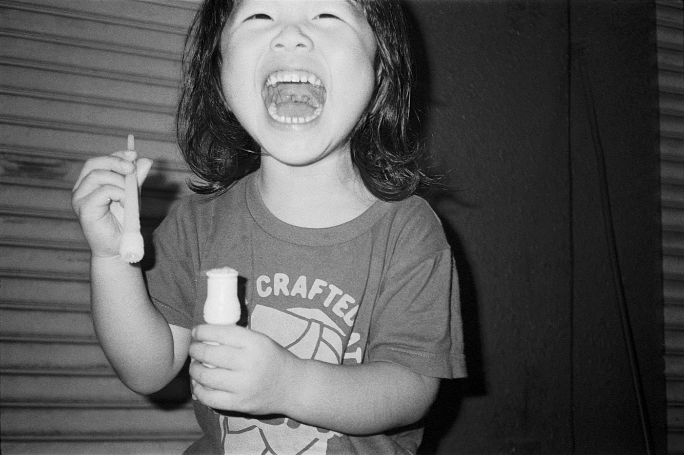

I chose these two photos of kids for this zine because although kids can be seen as weak, they are able to accept situations as they are and enjoy themselves with an open mind and willingness to adapt.

In the great scheme of things every human being is incredibly fragile, not much stronger than a little kid.
Since last year when these photos were taken, Covid-19 has even further exposed the weakness of human beings.

“Don’t kill. Protect your weakness.”
I interpreted this to mean: if we can comprehend and accept our own weakness, we can empathise with and look after each other more.
If we are willing to approach this new situation with the open mindedness and adaptability of a kid, I think it will be easy to achieve the goal of this slogan.

このZINEのためにこの2枚の子供の写真を選びました。子供は弱いと思われがちですが、あるがままの状況を受け入れ、開いた心を持ちつつ、適応しようとする姿勢を持って楽しんでいるからです。

考えてみると、人間とはみんな信じられないほど脆く、小さな子供よりも強くはないものです。
これらの写真が撮影された昨年から、コロナウィルスは人間の弱さをさらに露呈させています。

"殺すな。弱さを守れ"
私はこれを、「自分の弱さを理解し、受け入れることができれば、より共感し、お互いを思いやることができる」という意味だと解釈しました。
この新しい状況に、子供のような素直さと順応性を持って臨めば、このスローガンの目的は簡単に達成できるのではないでしょうか。
