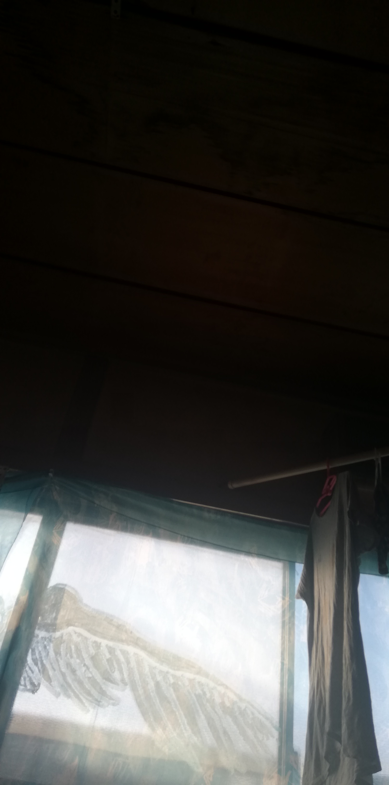

ある日思い立ち、 私の部屋の窓に 絵を書いてもらいました。
日頃、殺風景だなー と思っていたので。
部屋は２階で、窓を開けると 空がひらけて見えます。

私は羽がついた 人間の絵を描いて、 とリクエストしました。
ミヒャエルエンデの 小説に出てくる、 天使の試験の話があります。
一度読んだら 忘れられない話です。
そのことが その時の頭にありました。

時間をかけて、窓いっぱいに 描き上げられた絵は、
普通の人の等身大よりも 大きく、力強い半裸体で、
そして背中には 大きな羽が くっついていていました。
が、意外なことに 男は窓から こちらを向いていました。
まるで今しがた、 天から降り立ったかのように。

それを見て、私は、 その男が空に 飛び立っていくところを
イメージしていたのだと 分かりました。
描かれるのは向こうを 向いている男の 背中のはずだったので、
その人がこちらを 向いていることに 驚きました。

まるで私を 迎えにきたみたいだ。
でも、またすぐに 翔んでいってしまいそうだ。
もし、どこに向かうのか 教えられずに、 手を差し出されたら、
私は一緒に ついてゆくだろうか？
それは行きたい、 けど、帰ってこれるかな？
私は羽ばたくことが できるのか、 その時何を得て 何を捨てるのか。

と、窓を眺め、 時々考えたりします。
風通しの良い窓で、 外からも丸見えなので、 近所の人からは、
あー、あの絵のお家かね、 そういう芸術みたいなことを してるんですね？
などと言って もらえるようになりました。
消そうかとも思ったことも ありましたが、 そのままにしています。

### さや
#### Tenniscoats / majikick

### 「エンデ」

#### 詞  さや

忘れ物はないか
鍵は全部空けておいたか
鏡のぞき込んで
やめることはもうないか

旅の人よどうか
僕も連れてってくれませんか？
じぶん、おもい、運びながら
頼まれたら何だって聞くのか？

羽が生えるはずの
背中、赤く腫れて
回る、声に振り向かず
天馬塔へ急げ

誰かおりませんか？
ここはがらん洞でしたか？
跳ね返りながら、声は
ここに残りたいと思った

僕は誰の声だ？
こだまになって答えてみる
また夢をみたいな
映すことをやめぬ鏡

振り向いてしまうからだ
翼だけが飛んでく
見送った、空をひろげ
初めて会う朝

#### Tenniscoats / Ende  (Music Exists Disc.4)
