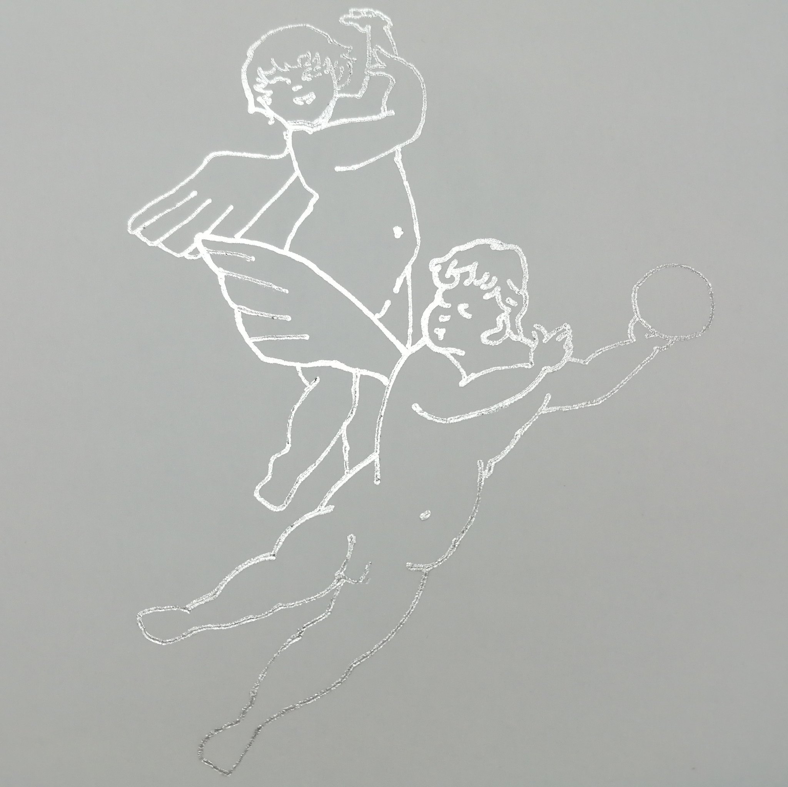

住み慣れたシェアハウスを はなれ、家をかえた。 
いまの僕の家に 日照りはないが、 少しばかり陽が差し込む。 
越してきた当初、 家は僕を見、 インストールした。 
昼はうすぐらく、 夜になると黒くなる。 裏手は墓地で、 かれらも僕をみていた。 
それからしばらくたって、 僕が家をみる番になった。 
家の近くに、 二人の天使像があることに、 気がついた。

弱さとは、群れること ではなく、また逆に、 なにものかを 拒むことでもない。 
弱さとは、弱さを感じること feel our weaknesses だと思う。 
繊細さ、アンニュイなさま、 社会的、肉体的に 溌剌としていないようす…。 
僕はそういったものを 感じるとき、目と耳のあいだ、 ちょうどこめかみの 内側あたりが、ふわっとする。 
家に殆ど入らない陽が、 僕に差し込む感覚を おもいだす。 
たぶん、ここでいう弱さって 幾千と種類があって、 それらをすべて感じることは まだできない。 
ただ、家の近くの あの天使像を見つけたとき、 未知の弱さを 知ったように思う。

このZINEでは、 ひとり一人ちがう弱さを もっている。 
それぞれ独立した個人で、 知らない人もいれば、 場所も離れ滅多に会うことの ない人もいる。 
それでも、その人たちを 感じることはできる。 そして、おぼえておくことが できる。

SNSでも手紙でも なんでもいい。もはや、 Doomscrolling でも、なんでも。 
天使像のある場所を おぼえるように、 その弱さを こめかみの内側で感じる。 
知らない人の弱さにも、 歩いていたら 出会うかもしれない。 ここのように。 
そのようにして、 僕は弱さたちを こめかみの内側にしまい、 
知らない人や見えない人を 引き連れながら、 いろんなできごとに 出会いたい。

わたしたちはあなたたちの ことを知らないけれど、 あなたたちのことを 感じている。

